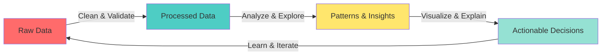

#  Hey, I'm Abhinav

<div align="center">
  
  <!-- Animated Banner -->
  
  
  +Student+%F0%9F%8E%93;Building+Systems+That+Make+Sense+%E2%9A%99%EF%B8%8F)

  <!-- Animated Badges -->
  <p>
    
    
    
    
  </p>

</div>

---

## 🎯 Quick Navigation

<div align="center">

[](#-who-am-i)
[](#-my-philosophy)
[](#️-tech-stack)
[](#-what-im-working-on)
[](#-lets-connect)

</div>

---

## 🧠 Who Am I?


```python
class Abhinav:
    def __init__(self):
        self.username = "AbhinavEH"
        self.role = "Aspiring Data Analyst"
        self.education = "BCA (AI) Student"
        self.location = "Mangaluru, Karnataka, IN"
        
    def current_focus(self):
        return {
            "learning": ["Data Analysis", "System Design", "AI Concepts"],
            "exploring": ["Pattern Recognition", "Data Pipelines"],
            "building": ["Small Projects That Teach Big Lessons"]
        }
    
    def fun_fact(self):
        return "I break things just to understand how to fix them 🔧"
    
    def my_approach(self):
        while True:
            self.break_something()
            self.learn_from_it()
            self.build_better()
```

<br clear="right"/>

### 🌟 What Drives Me

> **"The data says this"** ➜ **"This insight actually helps someone decide"**

I don't just analyze data — I translate it into decisions. I value:

<div align="center">

| 🎯 Clarity | 🧩 Logic | 📖 Learning |
|:---:|:---:|:---:|
| Over Complexity | Over Hype | Over Pretending |

</div>

---

## 💭 My Philosophy

<details open>
<summary><b>🔥 Click to expand my core beliefs</b></summary>
<br>

```yaml
Data_Principles:
  🎯 Core_Belief: "Fancy models don't fix bad data"
  
  🔍 Analysis_Approach:
    - Clean data before trusting it
    - Understand trends, not just plot graphs
    - Ask right questions before running models
    - Make outputs readable for humans
  
  💡 Problem_Solving:
    - "If you can't explain the insight, it's not useful"
    - "'It works' means nothing without 'it's reliable'"
    - "Small, correct logic beats big, confusing code"
  
  📚 Learning_Mindset:
    - Learning deeply > Learning fast
    - Understanding fundamentals saves debugging hours
    - AI is powerful only when data is honest
```

</details>

---

## 🛠️ Tech Stack

<div align="center">

### 🎨 Languages


### 📚 Data Analysis & Libraries


### 🔧 Frameworks & Tools


</div>

---

<details>
<summary><b>🎯 Skill Breakdown - Click to view my competency matrix</b></summary>
<br>

```text
Data Analysis          ████████████████░░░░  80%
Python Programming     ███████████████░░░░░  75%
SQL & Databases        ██████████████░░░░░░  70%
Data Cleaning          ████████████████░░░░  80%
Problem Solving        ███████████████░░░░░  75%
System Thinking        ████████████░░░░░░░░  60%
Web Development        ███████████░░░░░░░░░  55%
Machine Learning       ██████████░░░░░░░░░░  50%
```

</details>

---

## 🎓 What I Say vs. What I Focus On

<table>
<tr>
<td width="50%" valign="top">

### 📋 What I Say I Do

- ✅ Analyze data
- ✅ Write Python & SQL
- ✅ Build small systems
- ✅ Debug code that was *"working perfectly yesterday"*
- ✅ Learn AI concepts one step at a time


</td>
<td width="50%" valign="top">

### 🎯 What I Actually Focus On

**🔍 Data Analysis Mindset**
- Cleaning messy data before trusting it
- Understanding trends, not just plotting graphs
- Asking the right questions first
- Making insights human-readable

**⚙️ System Thinking**
- How data flows through applications
- How backend logic affects analysis
- How poor design leads to wrong insights


</td>
</tr>
</table>

---

## 🚀 What I'm Working On

<div align="center">



</div>

<table>
<tr>
<td width="50%">

### 🔬 Current Experiments

- 📊 Data cleaning pipelines
- 🤖 Simple ML models for predictions
- 🗄️ Database design patterns
- 🔍 EDA techniques & visualizations

</td>
<td width="50%">

### 📚 Learning Queue

- 📈 Advanced data visualization
- 🧠 Statistical analysis methods
- 🐍 Advanced Python techniques
- 💾 Data engineering basics

</td>
</tr>
</table>

---

## 📊 GitHub Analytics

<div align="center">
  
  
</div>

<div align="center">
  
  
</div>

---

## 🏆 Achievements & Highlights

<div align="center">

[](https://github.com/ryo-ma/github-profile-trophy)

</div>

---

## 💡 Today's Dev Quote

<div align="center">


</div>

---

## 🤝 Let's Connect

<div align="center">

### 📬 Reach Out To Me

<a href="https://github.com/AbhinavEH">
  
</a>
<a href="https://www.linkedin.com/in/abhinav">
  
</a>
<a href="mailto:abhinavgowda1305@gmail.com">
  
</a>

### 💬 Let's Talk About

<p>
  
  
  
  
  
</p>

</div>

---

<div align="center">

### 🌱 *Still learning. Still building. Still improving.*


**⭐ If you find my profile interesting, consider dropping a star on my repositories!**

</div>

---

<div align="center">
  
</div>
